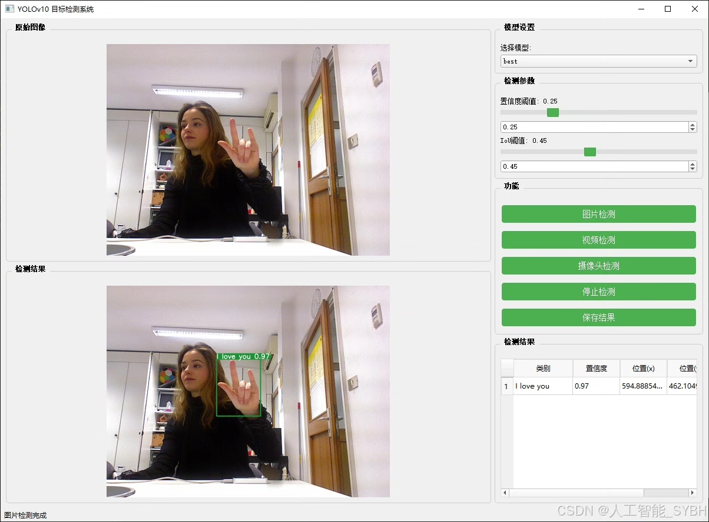
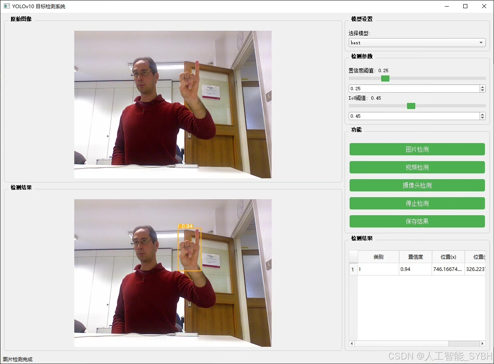
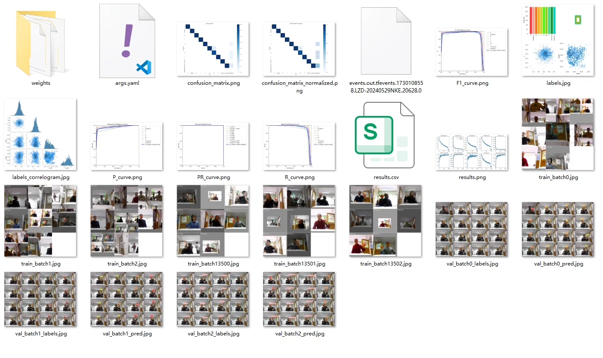
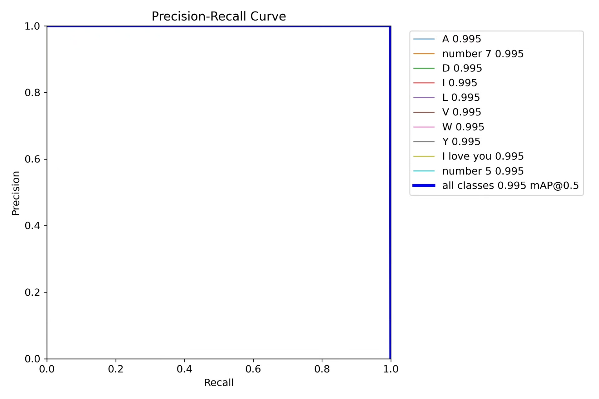
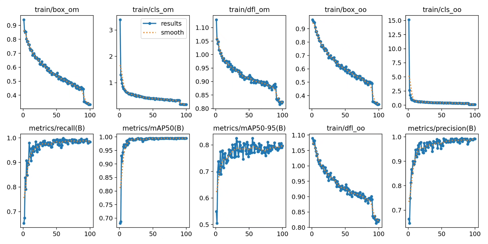
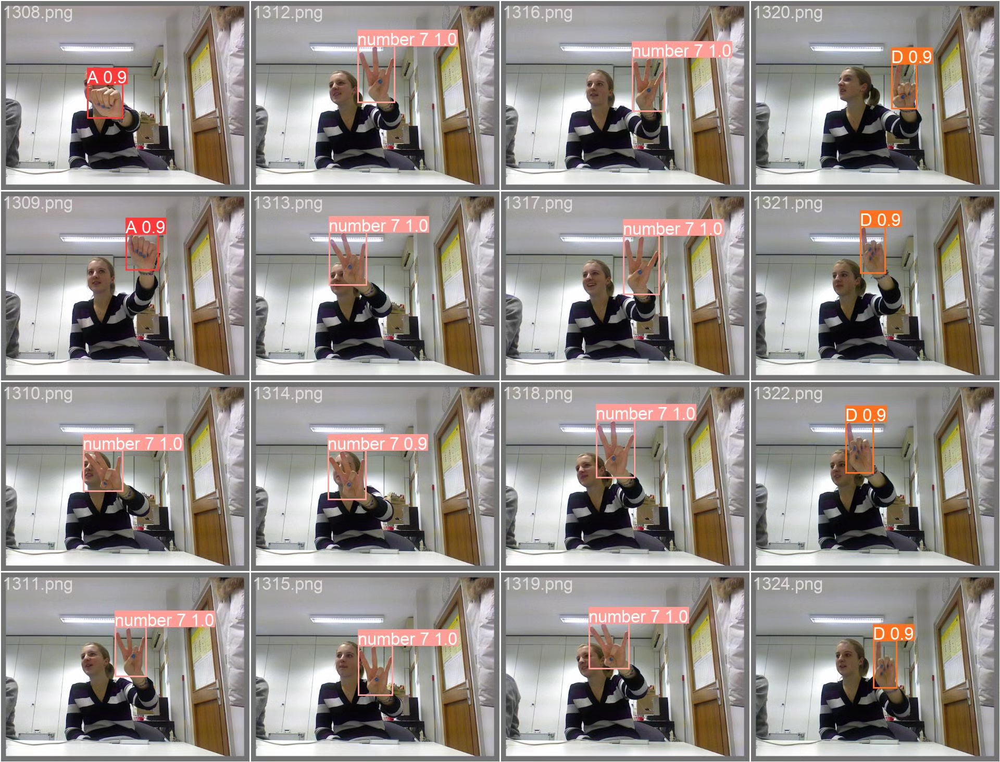
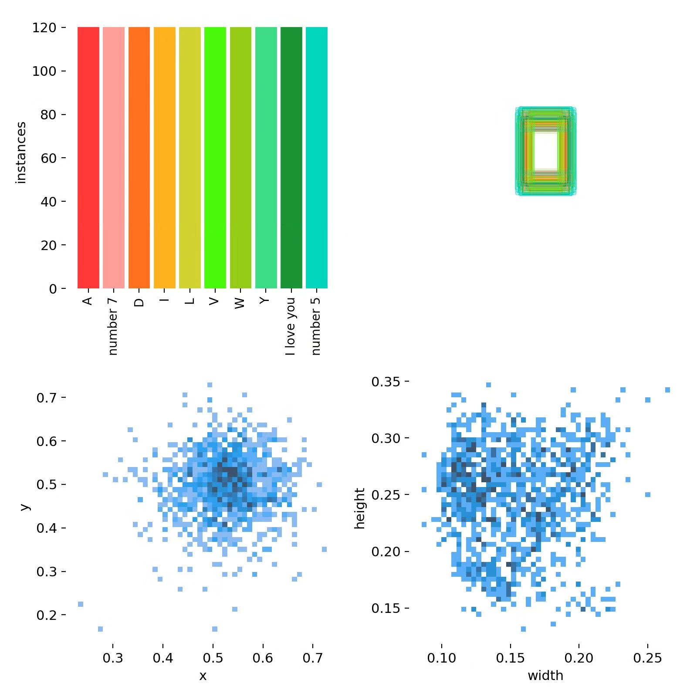
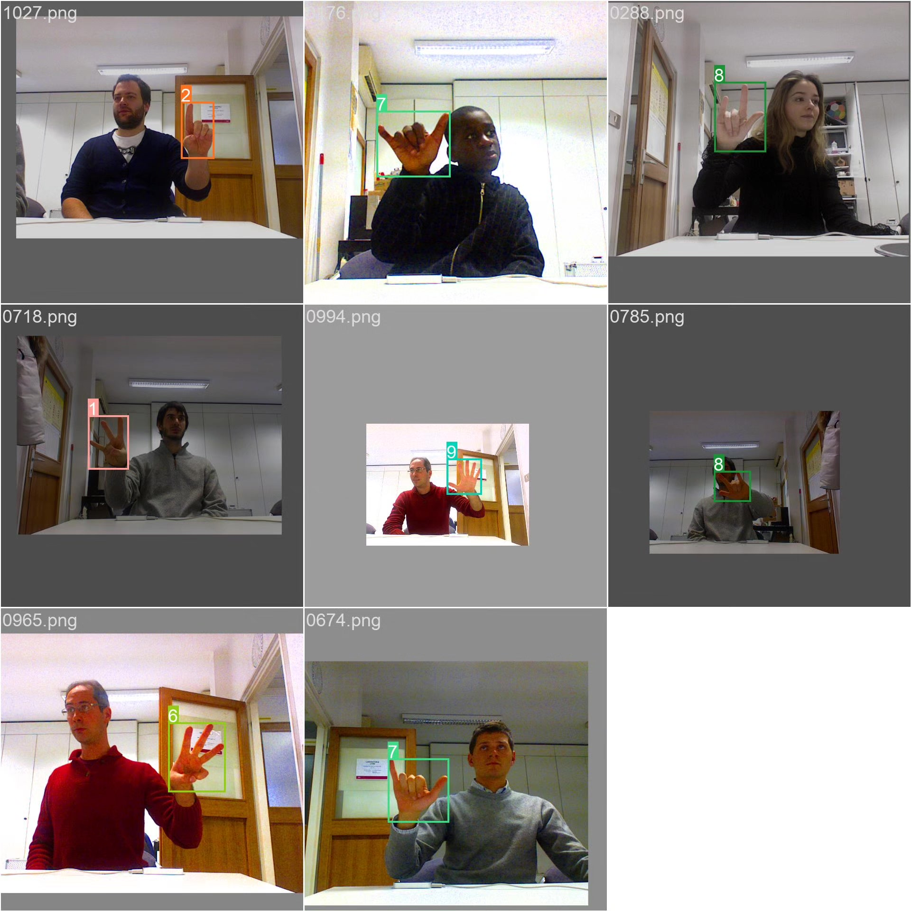

# Gesture Recognition Detection System Based on Deep Learning YOLOv10

## Body

A gesture recognition system based on YOLOv10, including the YOLOv10+YOLO dataset, UI interface, Python project source code, and model.

Gesture recognition as an important way of human-computer interaction has a broad application prospect in intelligent device control, sign language translation, and virtual reality fields. This study proposes a real-time gesture recognition detection system based on YOLOv10, which can accurately recognize 10 common gestures (including letter gestures A, D, I, L, V, W, Y, "I love you" gesture, and number gestures 5 and 7).

The company's products have obtained the official commercial license certification from YOLO.

We provide after-sales service.

After payment, we will provide WeChat ID for any questions.

Environment configuration: We will provide a tutorial on environment configuration, and WeChat will provide answers to questions.

Remote installation service: If you need remote configuration, an additional fee of 69 is required, with all fees refunded if the configuration fails (only refund installation fees for older computers).

Retraining dataset: After configuring the environment, you can train on your own computer. If you need us to retrain, just pay 69 plus computing power fees (2.5 yuan/hour).

Full after-sales service

## Images

## Payment

Here is a pay link on Stripe ( https://buy.stripe.com/3cs8yP7sY87d0vu9AB ). Please contact me lonlonago@foxmail.com after funding $89, and I will send you a complete data files , thank you!

